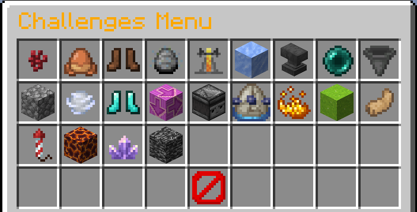
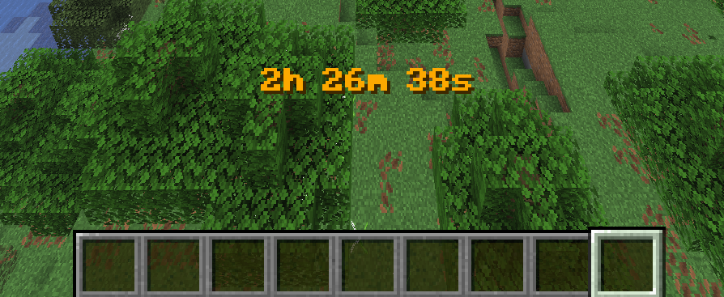
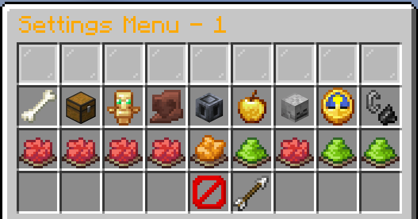
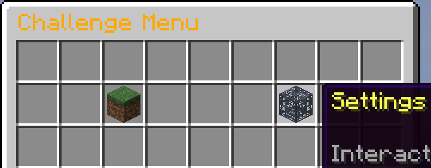
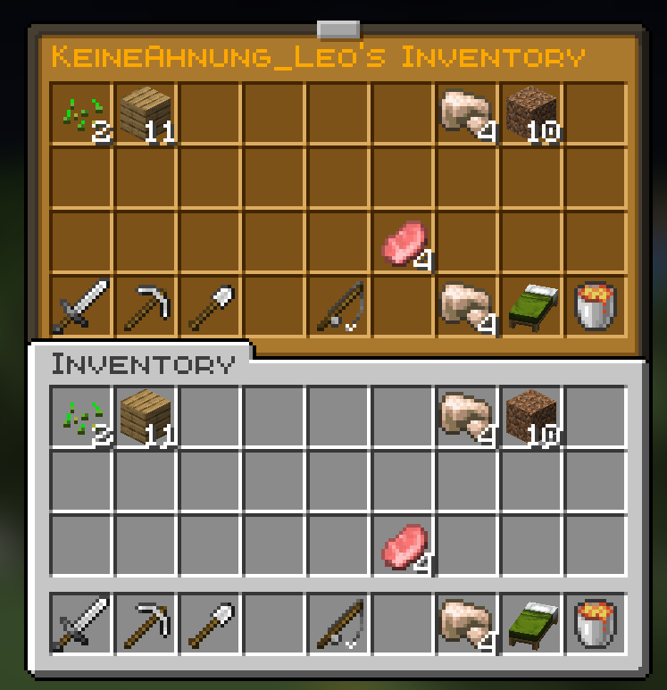

# Survival Challenges Plugin
The Survival Challenges Plugin is a Minecraft Spigot plugin for servers that adds 23 unique gameplay challenges to your survival adventure.
Each challenge changes the way you play Minecraft Survival, making the game either easier or more difficult.
Players can enable one or multiple challenges and attempt to reach their goal. Whether that is defeating the Ender Dragon, the Wither, the Elder Guardian, the Warden, or simply surviving as long as possible.
All challenges are fully configurable and can also be combined to create completely new gameplay experiences.
## Challenges
The following challenges are available:

### Delayed Damage
> Damage is applied only every five minutes and summed.
### Damage Jump
> Launches the player into the air based on the amount of damage they have taken.
### Mob Jump
> Spawns a random mob whenever a player jumps.
### Mob Duplicator
> Each mob that dies multiplies 2x, 4x, or 8x based on how many times it already died.
### Damage = Random Effect
> Whenever a player takes damage, all players get a random potion effect.
### Ice Floor
> When a player sneaks, a 3x3 ice floor is generated below them.
### Anvil Rain
> Anvils rain wherever a player walks.
### Damage = Random Teleport
> Whenever a player takes damage, all players are teleported to random locations.
### Item Pickup Damage
> Picking up or moving items in UI deals damage based on amount.
### Only One Block Use
> Players can switch a block below them only once.
### Gravity Switch
> Gravity changes every few minutes affecting all entities.
### Jump Strength
> When a player jumps, others jump higher.
### Chunk = Random Block
> All blocks in a chunk are replaced with random ones.
### Chunk Synchronisation
> Placed or destroyed blocks are synchronized across all chunks.
### Chunk = Random Mob
> Entering a chunk spawns a random mob that must be killed to progress to the next chunk.
### Chunk = 60sec
> Chunks are removed 60 seconds after a player enters them.
### Traffic Light
> Traffic lights switch to red every few minutes, forcing players to stop moving.
### Speedy
> All entities move very fast.
### Player Boost
> Every few seconds or minutes, the player is boosted in a random direction.
### Lava Floor
> Wherever a player walks, the floor turns into lava.
### Flying Floor
> Wherever a player walks, the floor flies in the air.
### Bedrock Wall
> Wherever a player walks, a large bedrock wall follows. (You can select multible challenges)
## Timer 
The timer is a main feature of the plugin.
It tracks how long the challenge run has been active and is required for every challenge to function.
Challenges are only active while the timer is running.
The timer can also be paused, reset, customized, or hidden depending on your settings.

## Settings
In addition to challenges, the plugin includes several configurable gameplay settings.
These settings can be combined with any challenge.

### Limited Players
> Disables player actions while the timer is paused.
### Backpack
> Players can open a backpack with /backpack.
### Split Hearts
> All players share the same health and take equal damage.
### Damage Logger
> Logs every damage a player receives in chat.
### Hardcore
> No respawn allowed after death.
### Regeneration
> Players naturally regain health over time.
### Show Death Screen
> Displays the death screen when a player dies.
### Timer Pause
> Pauses the timer when a player dies.
### Fire Tick
> Fire can burn wooden blocks and spread through them.
### Difficulty
> Sets how difficult the game is.
### Boss Required
> A boss must be killed to stop the timer.
### Damage = Inv Clear
> When a player takes damage all players' inventories are cleared.
### PvP
> Players can hit each-other.
### Keep Inventory
> Players keep their inventory after death. (All settings are compatible with every challenge)
## Commands
The plugin also includes several commands for server operators.
* ### /challengemenu
> Opens the challenge menu where challenges can be enabled and settings can be configured.

* ### /timer
> This controls the challenge timer. You can start, stop, pause, reset, hide, change its color, or manually set the time.
* ### /position 
> Saves waypoints at your current location so you can find back to them later.
* ### /invsee
> Allows operators to view the inventory of another online player.

* ### /reset
> Resets specific configurations or restores all settings to their defaults.
* ### /joker
> Adds or removes jokers from players.
* ### /backpack
> Opens either a player-based or team-based backpack.
## How to install/use
To use this plugin, you need a Spigot-based Minecraft server.
* Minecraft 1.21.10 or newer
* A Spigot-compatible server (Spigot, Paper, etc.)

It is important to note that when the server stops, the plugin saves the data from the timer, challenges, settings, and backpack. To do this, it creates another folder in the plugins folder with the .yml files.
### Installation:
* Download the plugin `SurvivalChallengesPlugin-1.0.jar` in `Release-1.0`
* Place it in your server's plugins folder
* Restart the server
The plugin will automatically load.
## Note
This plugin was created by KeineAhnungLeo and is open source.
Some challenge ideas were inspired by the German YouTuber [BastiGHG](https://www.youtube.com/@BastiGHG), whose content features various Minecraft challenge concepts.
The plugin will continue to receive some updates with new challenges, features, and improvements in the future.
For a more visual showcase, you can watch [this video](https://youtu.be/VabsHEpdYWI).